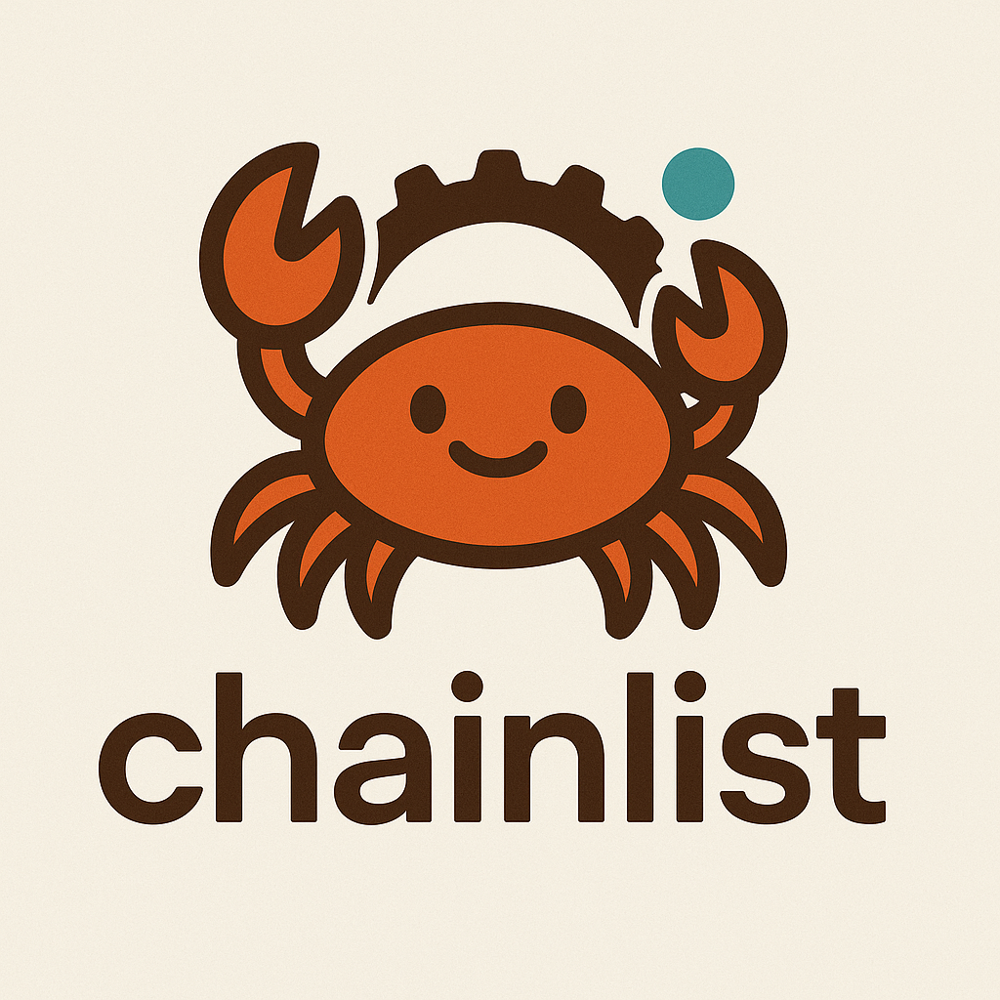

# chainlist • [](https://github.com/refcell/chainlist/actions/workflows/ci.yaml)  [](https://crates.io/crates/chainlist)



**Minimal** `no_std` rust bindings for the [Chainlist API][api] built in pure Rust.

[api]: https://chainlist.org/rpcs.json

### Getting Started

Add the `chainlist` crate to your project:

```toml
chainlist = "0.1.0"
```


### Usage

```rust
use chainlist::{rpc, Chain, CHAINS};

// Get the RPC Configuration for Ethereum Mainnet.
let mainnet = CHAINS.iter().find(|c| c.chain_id == Some(1)).expect("exists");
assert_eq!(mainnet.name, "Ethereum Mainnet");

// Using the `rpc!` macro.
let mainnet = rpc!(1);
assert_eq!(mainnet.name, "Ethereum Mainnet");

// Get the `Chain` RPC configuration from an alloy "NamedChain".
// Note, this will panic if an RPC configuration doesn't exist
// in the chain list for the given chain id.
let mainnet: Chain = alloy_chains::NamedChain::Mainnet.into();
assert_eq!(mainnet.chain_id, Some(alloy_chains::NamedChain::Mainnet as u64));
```

## Safety

> **Warning**
>
> This is **experimental software** and is provided on an "as is" and "as available" basis.
> Expect rapid iteration and **use at your own risk**.

## License

[MIT](https://github.com/refcell/chainlist/blob/main/LICENSE)


## Acknowledgements

- [Alloy Core Contributors](https://github.com/alloy-rs)
